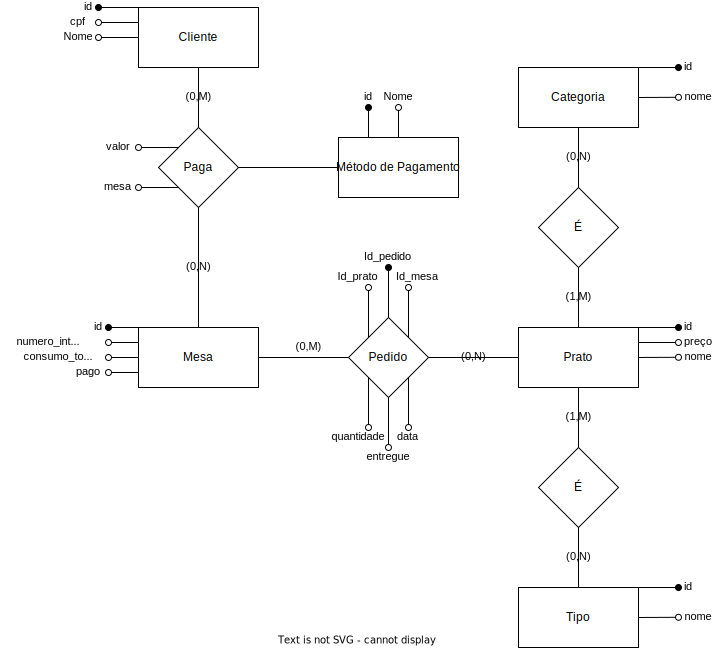

# Parte 1 do projeto da disciplina de Banco de Dados I

Será implementado um sistema para controle de pedidos em um restaurante.

# Modelagem UML
## Diagrama Entidade-relacionamento

## Modelagem Relacional
**Mesa (<ins>Id</ins>, numero_integrantes, consumo_total, pago)**

**Prato (<ins>Id</ins>, preco, nome)**

**Categoria (<ins>Id</ins>, nome)**

**Tipo (<ins>Id</ins>, nome)**

**Pedido (<ins>Id</ins>, <ins>Id_mesa</ins>, <ins>Id_prato</ins>, qunatidade_pratos, entregue, data)**

**Prato_categoria (<ins>Id_prato</ins>, <ins>Id_categoria</ins>)**

**Prato_tipo (<ins>Id_prato</ins>, <ins>Id_tipo</ins>)**

**Cliente (<ins>id</ins>, cpf, nome)**

**Pagamento (<ins>id</ins>, valor, metodo_pagamento, mesa_id, cliente_id)**

## Diagrama de classes

OBS: os métodos públicos foram ocultados por motivos de simplificação.

# Dependências:

- Linguagem de Programação: <a href="www.python.org">Python</a> - Versão 3.11.3
- Query Builder: <a href="https://www.psycopg.org/"> Psycopg</a> - Versão 3.1
- SGBD: <a href="www.postgresql.org"> PostgreSQL</a> - Versão 15.2-2
- HTML, CSS e JavaScript
