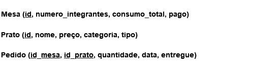
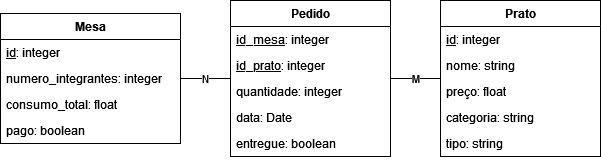

# Parte 1 do projeto da disciplina de Banco de Dados I

Será implementado um sistema para controle de pedidos em um restaurante.

# Modelagem UML
## Diagrama Entidade-relacionamento

## Modelagem Relacional

## Diagrama de classes

OBS: os métodos públicos foram ocultados por motivos de simplificação.

# Dependências:

- Linguagem de Programação: <a href="www.python.org">Python</a> - Versão 3.11.3
- Query Builder: <a href="https://www.psycopg.org/"> Psycopg</a> - Versão 3.1
- SGBD: <a href="www.postgresql.org"> PostgreSQL</a> - Versão 15.2-2
- HTML, CSS e JavaScript
